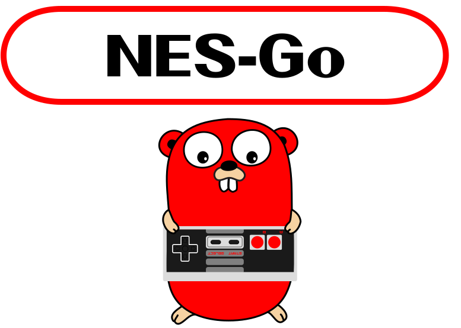

<p align="center">

</p>

This repository implements an NES emulator in GoLang. The front-end is provided
through a web interface using WebSockets to communicate with the GoLang
back-end. The emulator itself is written in C++ and integrated with GoLang
using `cgo` to load the shared object library.

## Usage

### Compilation

To compile the C++ shared object library:

```shell
make compileC
```

To compile the Go emulation micro-service:

```shell
make compileGo
```

To compile the C++ shared object library and Go micro-service in cascade:

```shell
make compile
```

### Execution

To start the Go emulation server:

```shell
make run
```

To run the HTTP page server:

```shell
make serve
```

## Controls

| Keyboard Key | NES Joypad    |
|:-------------|:--------------|
| W            | Up            |
| A            | Left          |
| S            | Down          |
| D            | Right         |
| O            | A             |
| P            | B             |
| Enter        | Start         |
| Space        | Select        |
